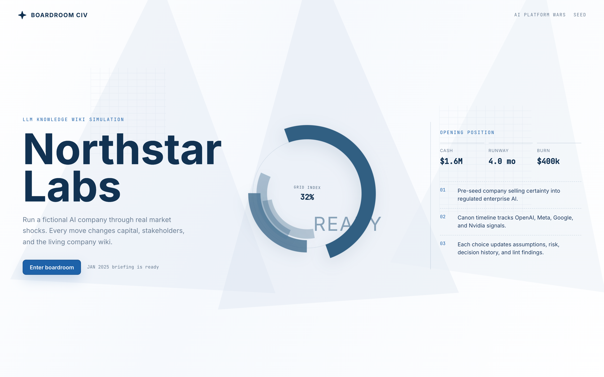
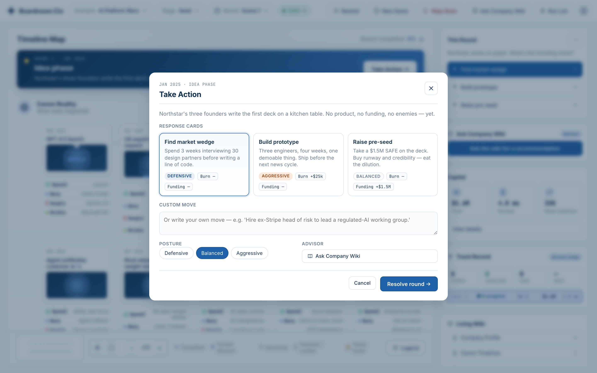
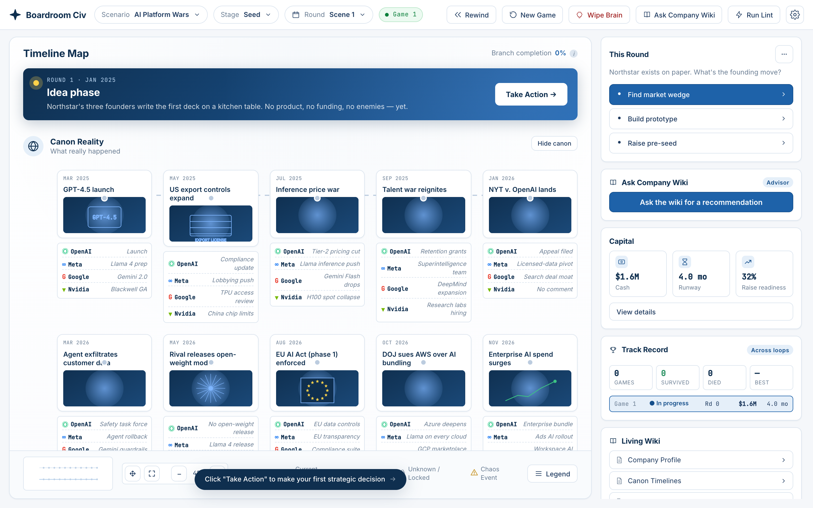
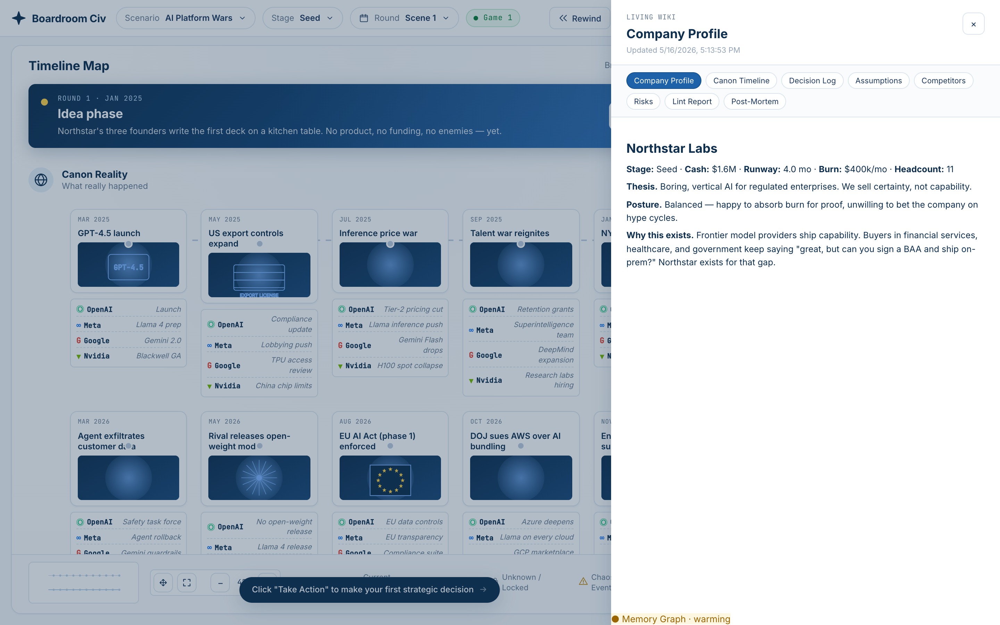

# Boardroom Civ

**Civilization meets Silicon Valley, powered by an agent-maintained LLM Wiki.**



Boardroom Civ is a turn-based company strategy simulator for hackathon demos. The user plays as the leadership team of an imaginary startup and reacts to major world, market, regulatory, and technology events. Every decision changes the hypothetical world, and the agent records those changes in a persistent wiki.

The key idea is not just to make a branching story game. The game state is an evolving LLM Knowledge Wiki: the agent ingests events, writes and updates structured pages, answers strategic questions from the wiki, and lints its own world model for contradictions, stale assumptions, and missing context.

## Screenshots

| Take Action — pick a response card, posture, and advisor | Timeline Map — canon reality + branching board |
| -------------------------------------------------------- | ---------------------------------------------- |
|      |    |



## Concept

The player acts as a high-level company leader: CEO, board member, strategy chief, or crisis lead. The app presents major events that could affect the company, such as:

- A competitor open-sources a powerful model.
- A regulator announces a new compliance framework.
- A cloud provider raises compute prices.
- A viral safety incident damages public trust.
- A large enterprise customer demands an on-prem deployment.
- A rival startup launches a suspiciously similar product.

At each event, the player chooses how to respond. They can pick from strategic action cards or write a custom prompt to the agent.

The hypothetical world then reacts. The agent updates the company wiki, including strategy, timeline, competitors, assumptions, risks, decision history, and consequences.

## Why It Fits The Hackathon

The host brief asks for an LLM Knowledge Wiki project with three core operations: **Ingest**, **Query + Self-improve**, and **Lint**. Boardroom Civ turns those requirements into a playable product.

### Ingest

The system ingests event material and builds wiki pages for:

- World events
- Companies and competitors
- Market forces
- Regulations
- Technical constraints
- Strategic risks
- Causal relationships

### Query + Self-improve

The player can ask questions like:

- "Why did our reputation drop?"
- "What assumptions led to this forecast?"
- "What should we do next?"
- "Which competitor is most dangerous now?"
- "What did our last decision change?"

After each turn, the agent improves the wiki by adding missing pages, updating stale strategy notes, logging new assumptions, and connecting related concepts. When the run ends — death, acquisition, merger, IPO, or surviving the canon arc — a dedicated post-mortem agent reflects on the cause, writes the **Post-Mortem** wiki page, and ingests the lessons into the cognee graph so the next game's advisor recalls them.

### Lint

The agent runs a wiki lint pass to detect:

- Contradictions between company state and narrative outcomes
- Unsupported claims
- Missing actor, event, or assumption pages
- Orphaned pages
- Stale facts
- Impossible causal jumps
- Strategy changes that were not reflected in the company profile

The lint results become part of the demo: users can see the agent improve its own memory instead of simply generating one-off text.

## Product Loop

1. **Start with a fictional company.**
   The player leads an imaginary startup operating in a chaotic tech market.

2. **Ingest a major event.**
   The app shows a news-style event card with relevant context.

3. **Choose a leadership response.**
   The player chooses an action card or writes a custom response.

4. **Simulate consequences.**
   The agent projects how customers, regulators, competitors, investors, employees, and the market react.

5. **Update the wiki.**
   The system writes changes into persistent pages such as `Company Strategy`, `Timeline`, `Competitors`, `Risks`, `Assumptions`, and `Decision Log`.

6. **Query the world.**
   The player can ask the agent to explain the current state or recommend a next move.

7. **Lint and self-improve.**
   The agent checks the wiki and patches weak spots before the next turn.

## Quickstart

Prereqs: Node 18+ and [`uv`](https://docs.astral.sh/uv/) (`brew install uv` on macOS). `uv` runs the Python sidecar in an ephemeral venv, so you don't manage Python deps manually.

```bash
npm install
npm run dev
```

Then open <http://127.0.0.1:5180/>.

The dev script runs three processes concurrently:

| service              | port | role                                                                                           |
| -------------------- | ---: | ---------------------------------------------------------------------------------------------- |
| Vite (web)           | 5180 | React app                                                                                      |
| Express (api)        | 5181 | Agent endpoints (`/api/resolve`, `/chaos`, `/advisor`, `/lint`, `/postmortem`, `/memory-stats`) |
| Cognee sidecar (py)  | 5182 | FastAPI wrapper around the cognee knowledge graph (Ingest / Query / Audit)                     |

The first `npm run dev` installs cognee + ~130 transitive deps via `uv` and downloads the local embedding model — expect 30–90 seconds on cold start. Subsequent runs are instant.

### Going live with Claude

Copy `.env.example` → `.env` and set:

```
ANTHROPIC_API_KEY=sk-ant-...
ANTHROPIC_MODEL=claude-opus-4-7
```

Restart `npm run dev`. The server log will switch from `OFFLINE (deterministic fallback)` to `LIVE (Anthropic API)`. Every action resolution, advisor query, and lint pass will be a real LLM call.

If a call fails for any reason the server falls back per-request, so the demo never breaks mid-show.

## MVP Demo Flow (3 minutes)

1. **Scene 1 — Idea phase.** Right rail shows three founding moves. Open **Take Action**, pick *Raise pre-seed*, posture *Balanced*, **Resolve round**.
2. **GPT-4.5 launch.** Top bar now reads *Mar 2025*. Hit **Ask Company Wiki** — the advisor returns a ranked recommendation with success bars and a *blind-spot* warning that chaos events are not modeled.
3. **Resolve a few rounds.** Watch the branch fill in. Capital, runway, and raise readiness all move with each decision. The **Chaos Director** agent fires a fresh, context-aware shock on roughly one in three rounds (and very rarely, a game-ending offer — see *Endings* below).
4. **Open the Living Wiki.** Click any section — *Company Profile*, *Decision Log*, *Assumptions*. Each page was rewritten by the agent in response to the rounds you played.
5. **Run Lint** in the top bar. The agent inspects its own wiki and surfaces findings (e.g. *runway snapshot stale*, *shaky assumption not linked*).
6. **End the run.** Cash zero, thesis collapse, or an ending-tier chaos closes the run. The post-mortem agent writes a structured reflection into the **Post-Mortem** wiki section and ingests it into the cognee graph so the next game's advisor recalls the lessons.
7. **Reset** returns the world to Scene 1 — no branch history, fresh wiki.

### Endings

A run ends in one of five ways. Each is rendered in the GameOverModal and as a Markdown post-mortem in the wiki.

| status     | trigger                                                                                              |
| ---------- | ---------------------------------------------------------------------------------------------------- |
| `dead`     | Cash hits 0, runway collapses with no funding in flight, or 2+ active assumptions break in one round |
| `acquired` | Chaos Director surfaces an `acquisition-offer` chaos with `endsGameAs: "acquired"` and it closes     |
| `merged`   | Chaos surfaces a `merger-offer`                                                                      |
| `ipo`      | Chaos surfaces an `ipo-window` (only eligible when cash > $20M, headcount >= 25, round >= 8)         |
| `ongoing`  | The canon arc finishes (round 12) with the company alive and no exit triggered                       |

Ending-tier chaos beats death — an acquirer closing pays off the runway problem regardless of cash. Death otherwise beats the round-12 `ongoing` fallback.

## UI

- **Timeline Map** ([screenshot](screenshots/03-timeline.png)) — large expandable branching map with canon reality and Northstar's branch.
- **Current Moment Panel** — compact summary of the current scene or canon event.
- **Take Action Modal** ([screenshot](screenshots/02-take-action.png)) — the only place where the user chooses a response, posture, advisor query, and round resolution.
- **Capital Panel** — cash, burn, runway, and raise readiness.
- **Living Wiki Panel** ([screenshot](screenshots/04-living-wiki.png)) — company profile, canon timelines, decision log, assumptions, lint, and post-mortem (filled in by the agent on game-over).
- **World Reaction Panel** — latest simulated consequences and chaos events (rendered inside the Decision Log section of the wiki drawer).

## Architecture

- **State** lives in a Zustand store (`src/state/store.ts`). The store is persisted to `localStorage` under `boardroom-civ:v2` (with a one-shot migration from `v1`), so a refresh keeps your branch.
- **Round resolution** is a single `POST /api/resolve` call. Server-side, that call fans out into two LLM agents:
  1. **Chaos Director** (`agentChaos`) — runs first, decides whether a shock or ending-tier offer hits this round, and returns a `ChaosEvent` (or `null`) with fields `kind`, `capitalDelta`, and optional `endsGameAs`.
  2. **World Simulator** (`agentResolve`) — receives the chaos verbatim in its prompt and narrates consequences around it (customers / investors / regulators / competitors / employees), plus `branchOutcomes`, `newAssumptions`, `updatedAssumptionIds`, and `wikiPatches`.

   The store applies the merged response atomically. Splitting the two agents lets the chaos be reasoned about with full game-state context (round, runway, headcount, recent reactions, prior decisions) and lets the simulator focus on narration. The chaos is also exposed directly at `POST /api/chaos` if you want to call it standalone.
- **Wiki sections** are kept as Markdown strings on `state.wiki` for rendering. The drawer renders them via a small inline Markdown renderer. The *Decision Log*, *Assumptions*, and *Company Profile* sections are re-derived from structured state every round. *Competitors* and *Risks* are append-only and patched by the agent. *Post-Mortem* is written once, at game-over, by the post-mortem agent (see below).
- **Post-mortem on game-over.** When `gameStatus` flips to non-alive (`dead | acquired | merged | ipo | ongoing`), the store fires `POST /api/postmortem`. The agent returns a structured `PostMortem` (root-cause chain, what killed / saved us, key lessons, compound strategies that would have worked). The store renders that as Markdown into the **Post-Mortem** wiki section *and* fires-and-forgets it into the cognee graph — so the next game's advisor recalls these lessons in its prompt.
- **Wiki memory** (separate from rendering) lives in a Cognee knowledge graph behind a Python FastAPI sidecar — see the next section.
- **The advisor never sees chaos.** Server-side, the advisor endpoint only receives wiki state — no chaos seed. That's deliberate: the demo makes the point that wiki-based reasoning has known limits.

## Cognee: the Living Wiki's memory layer

The Markdown wiki is what you read. The **memory** behind it lives in a [Cognee](https://www.cognee.ai/) knowledge graph. Cognee is an open-source agentic memory engine — it combines embeddings, a graph, and structured extraction so the same data is searchable by meaning *and* connected by relationships. In Boardroom Civ it backs all three hackathon operations end-to-end:

| operation | wire                          | what it actually does                                                                                                                                                                                                                                |
| --------- | ----------------------------- | ---------------------------------------------------------------------------------------------------------------------------------------------------------------------------------------------------------------------------------------------------- |
| Ingest    | `cognee.remember(text)`       | After every resolved round, the Express server fires-and-forgets a structured payload (event, action, world reaction, new assumptions, wiki patches) into the graph. Cognee runs add + cognify + improve in one call — entities and edges are extracted automatically. |
| Query     | `cognee.recall(query)`        | When you press **Ask Company Wiki**, the advisor first pulls graph-grounded excerpts about the current event from Cognee, then passes them to Claude with instructions to cite `[memN]` when they drove the recommendation. The advisor still never sees chaos. |
| Lint      | `cognee.recall(audit_query)`  | When you press **Run Lint**, Express asks Cognee for graph-level contradictions / stale facts / orphan entities, then hands those findings to Claude as `[gN]` evidence alongside the current Markdown wiki. Lint now reasons about the graph, not just the rendered text. |

### Process layout

```
[Vite :5180] ──> [Express :5181] ──HTTP──> [FastAPI cognee_sidecar :5182]
                                                    │
                                                    └── cognee 1.1.0
                                                         ├── LLM        = Anthropic via litellm  (reuses ANTHROPIC_API_KEY)
                                                         ├── Embeddings = fastembed (local, key-free)
                                                         └── Stores     = SQLite + LanceDB + KuzuDB (file-based)
```

Cognee is a Python library, so we run it as a small FastAPI sidecar (`cognee_sidecar/main.py`). Express talks to it over HTTP with short timeouts and throttled warnings. If the sidecar is down or `ANTHROPIC_API_KEY` is empty, every memory call silently no-ops and the game falls back to the deterministic offline simulator — the demo never breaks because cognee is offline.

### What you see in the UI

Open the Living Wiki drawer; a **Memory Graph** badge sits in the footer:

- `● Memory Graph · N rounds ingested · NN KB` — sidecar live, graph is writing
- `● Memory Graph · warming` — sidecar booted but `ANTHROPIC_API_KEY` is missing, so cognee can't init its LLM
- `● Memory Graph · offline` — sidecar unreachable; game still plays via fallback

Hitting **Reset** in the top bar also POSTs `/api/memory-reset`, which calls `cognee.forget(everything=True)` — the graph wipes alongside the game state.

### Configuration

All of these are in `.env.example`:

- **`ANTHROPIC_API_KEY`** — reused by both the game's Claude calls and Cognee's internal LLM (via litellm). One key, two consumers.
- **`COGNEE_LLM_MODEL`** — defaults to `claude-haiku-4-5-20251001` (cheap, fast for cognify). Override for higher-quality extraction.
- **`COGNEE_SIDECAR_URL`** / **`COGNEE_SIDECAR_PORT`** — where Express finds the sidecar.
- Embeddings are bundled — `fastembed` with `sentence-transformers/all-MiniLM-L6-v2` (384 dim). No second key needed.
- Graph data lives in `cognee_sidecar/.data/` and `cognee_sidecar/.system/` — both gitignored. Delete either folder for a hard reset.

## Repository Layout

```
.
├── index.html
├── package.json
├── vite.config.ts
├── cognee_sidecar/
│   ├── main.py            # FastAPI on :5182 — wraps cognee.remember/recall/forget
│   └── requirements.txt   # cognee, fastapi, uvicorn — run via `uv run --with-requirements`
├── server/
│   ├── index.ts        # Express on :5181 — /api/resolve, /chaos, /advisor, /lint, /postmortem, /memory-*
│   ├── agent.ts        # Anthropic SDK calls: agentChaos, agentResolve, agentAdvisor, agentLint, agentPostMortem
│   ├── cognee.ts       # thin HTTP client for the sidecar with soft-fail timeouts
│   ├── fallback.ts     # deterministic offline simulator (chaos + resolve + advisor + lint + post-mortem)
│   └── types.ts        # re-exports of src/types.ts
└── src/
    ├── main.tsx
    ├── App.tsx
    ├── types.ts        # ChaosEvent.kind/endsGameAs, GameStatus (alive|dead|acquired|merged|ipo|ongoing)
    ├── data/
    │   ├── canon.ts    # 12 canon events + action templates
    │   └── seed.ts     # Northstar Labs profile + seeded wiki (incl. empty Post-Mortem page)
    ├── state/store.ts  # Zustand store, persist, reducers, renderPostMortem helper
    ├── lib/format.ts
    ├── components/
    │   ├── TopBar.tsx
    │   ├── TimelineMap.tsx
    │   ├── RightRail.tsx       # Living Wiki panel — flags Post-Mortem with ● after game-over
    │   ├── TakeActionModal.tsx
    │   ├── WorldReactionModal.tsx
    │   ├── GameOverModal.tsx   # per-ending copy + eyebrow color (dead/acquired/merged/ipo/ongoing)
    │   └── LivingWikiDrawer.tsx  # renders the Memory Graph badge
    └── styles/globals.css
```

## Known Limits

- One company (Northstar Labs) and one scenario (AI Platform Wars). The canon timeline is fixed; you can extend `CANON_TIMELINE` in `src/data/canon.ts`.
- The timeline alignment treats Scene 1 as a virtual prelude that lives in the right rail, not on the map. Once the player resolves Scene 1, the branch row aligns with the canon row column-by-column.
- The minimap and zoom controls in the timeline footer are visual only — hooking up pan/zoom is left for later.

## Working Title Options

- Boardroom Civ
- Startup Civilization
- Counterfactual CEO
- Founder Mode
- Pivot Valley
- What If, Inc.

## Positioning

Boardroom Civ is a playable agent memory demo. It uses the fun of a strategy game to show the serious value of an LLM-maintained wiki: decisions compound, state persists, contradictions can be audited, and the agent gets smarter as the world evolves.

For the live pitch:

> "Think Civilization meets Silicon Valley. You play the leadership team of a fictional startup, and every decision rewrites the company wiki."

## Reference Inspiration

- [Karpathy's LLM Wiki idea](https://gist.github.com/karpathy/442a6bf555914893e9891c11519de94f)
- [Cognee](https://www.cognee.ai/) — the agentic memory engine backing the Living Wiki
- [Hackathon event brief](https://luma.com/uhda61yp)
